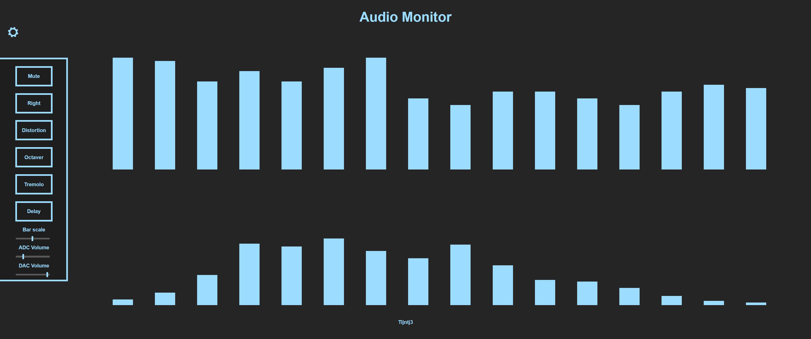

# Zybo Z7 Audiomonitor


Repository that contains the sources for the Zybo Z7 audio monitor project. The audio monitor system is designed for the Digilent Zybo Z7-10 and Zybo Z7-20 development boards. The project is a continuation of an Advanced Embedded Systems course's practical.

The main goal of the project is to make a demo for monitoring audio through a web interface hosted on the Zybo. Features of the audio monitor system are:
- Dual channel audio passthrough (ADC -> DAC) using the onboard SSM2603 audio codec
- I2S Serializer/Deserializer for processing PCM audio
- PS to PL audio codec configuration using I2C
- Audio effect chain, using [IP's](https://github.com/Vladilit/fpga-multi-effect) from Vladilit. (Zybo Z7-20 Only)
- PL to PS audio streaming
- Software implemented frequency spectrum, using JDUPUY's [FFT library](https://github.com/jdupuy/dj_fft)
- Simple webserver in CPPREST
- Web interface for controlling and monitoring the audio pipeline

## How to setup
1. Copy the BOOT.BIN and image.ub files from the SD_Card folder to an empty FAT32 formatted SD card.
2. Turn on the Zybo and log in to it via Serial or SSH. The username and password are both `root`.
3. Start the audio monitor system by running the following command:
    ````
    audiomonitor http://*Zybo's IP address*:*an unused port*
    ````
4. On another PC in the same network as the Zybo, navigate to http://*Zybo's IP address*:*port*/audiomonitor.html

## Web interface control options
After clicking the cog on the top left of the screen, the audio pipeline options reveal themselves.
\
Options for both boards are:
| Option       | Description | Default |
| :-- |:--| :-- |
| (Un)Mute | Sets the MUTE signal to the audio codec, turning the in- and outputs on/off. When off, PCM is replaced with zeroes. | Muted |
| Raw/Spectrum | Switches between displaying averaged PCM values (Raw) and the frequency spectrum (Spectrum). | Raw |
| Left/Right | Decides which of the two audio channels is streamed to the PS. | Left |
| Bar scale | Depending on the input volume/ADC/DAC settings the displayed bars can be either too large or small. This sliders allows the user to scale them independently of the audio pipeline. (Min value = 0, Max value = 63). | 10 |
| ADC volume | Sets the ADC (input) Volume. (Min value = 0, Max value = 63 ).| 10 |
| DAC volume | Sets the DAC (output) Volume. (Min value = 0, Max value = 127 ).| 121 |
\
Options for Zybo Z7-20 only:
| Option       | Description | Default |
| :-- |:--| :-- |
| (No) distortion | Turns on the distortion effect in the audio pipeline. The distortion setting is "1000" and as if now cannot be changed. | Off |
| (No) octaver | Turns on the octaver effect in the audio pipeline. The octaver setting is "1000" and as if now cannot be changed. | Off |
| (No) tremolo | Turns on the tremolo effect in the audio pipeline. The tremolo setting is "1000" and as if now cannot be changed. Note that the tremolo is sensitive to clipping due to PL multiplication. | Off |
| (No) delay | Turns on the delay effect in the audio pipeline. The delay setting is "1000" and as if now cannot be changed. | Off |